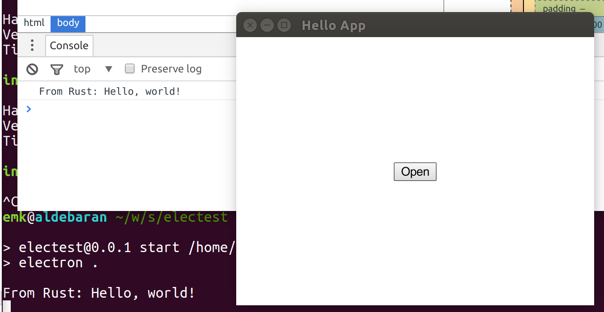

# TypeScript + Electron + React + Redux + Neon + Rust

This is a "spike", or throwaway project to prove that a particular set of
technologies can all actually play together.  This is all throwaway code.



Above: A Rust plugin running in Electron, in both the main process and the
renderer process.

The technologies involved:

- [TypeScript][]. Type-checking for JavaScript, with nice IDE support
  (including Emacs via `tide`).
- [Electron][]. Use JavaScript to write portable apps based on Chromium and
  NodeJS.
- [React][]. HTML user interfaces expressed as a function which transforms
  a data model into rendered HTML.
- [Redux][]. A data model and event framework for use with React.  Has
  support for undo, replay, event logs, time travel, etc.
- [Rust][]. A compiled language which is fast, safe and expressive.
- [Neon][]. Build NodeJS addons using Rust.
- [webpack][]. The glue that pieces everything else together.
- Duct tape.

[TypeScript]: https://www.typescriptlang.org/
[Electron]: http://electron.atom.io/
[React]: https://facebook.github.io/react/
[Redux]: http://redux.js.org/
[Rust]: https://www.rust-lang.org/
[Neon]: http://neon.rustbridge.io/
[webpack]: https://webpack.github.io/

## There are binaries!

Binaries for Linux are available on the [Releases][] page.  Binaries for
MacOS and Windows are presumably just a matter of messing around with the
build system and TravisCI/AppVeyor.

To install the binaries on Linux, download an `*.AppImage` file, put it
somewhere useful, run `chmod +x` on it, and execute it.  It will offer to
install icons, launcher items, and so forth the first time you run it.  See
the [AppImage][] site for more details—it's basically a self-running ISO
image that gets mounted on `/tmp`, with a complete Linux environment built
into it.  Imagine Docker for GUI applications.

Electron also offers an auto-update system, which I haven't looked into.

[Releases]: https://github.com/emk/electron-test/releases
[AppImage]: http://appimage.org/

## To run it

Install the React Developer Tools plugin in Chrome if you haven't already.

```sh
. env.sh
npm install -g typings
yarn
typings install
npm run install
npm start
```

To recompile the JavaScript code after making changes, try:

```sh
npm run watch
```

Note that our type definitions for TypeScript are still a bit dodgy.  In
particular, there are multiple sets of React type definitions, none of
which are really great.  We use a version installed via `package.json`
that's technically for React 0.14, even though we're running 0.15.

In the browser console the first time:

```js
require('electron-react-devtools').install()
```

When you're ready to produce a distributable binary, try the following on
Linux:

```sh
npm run dist
dist/electest-*-x86_64.AppImage
```
